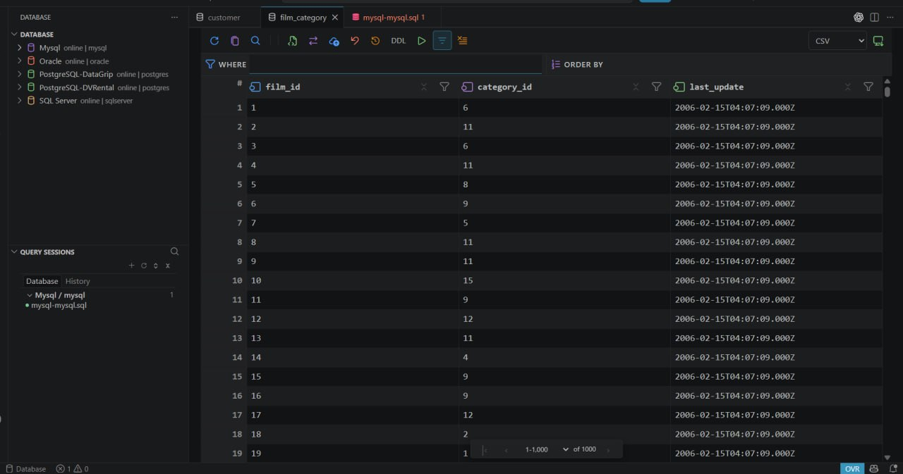
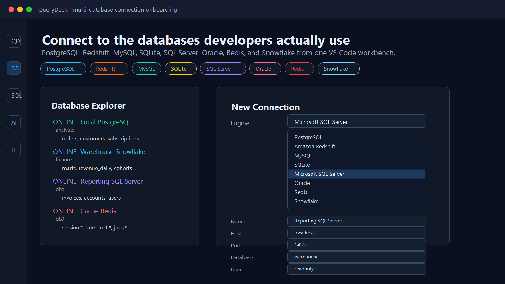
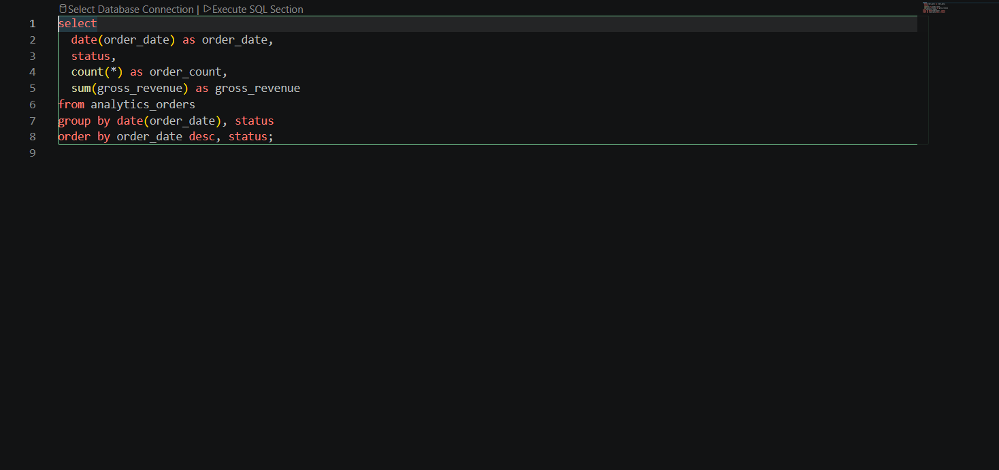
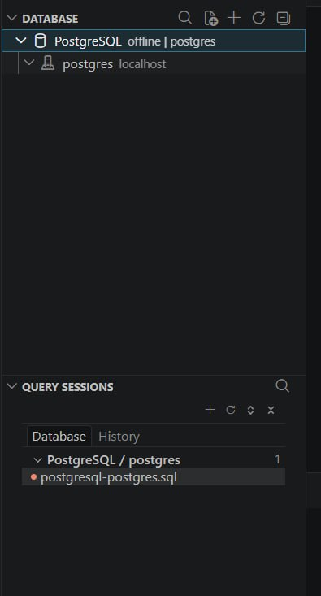
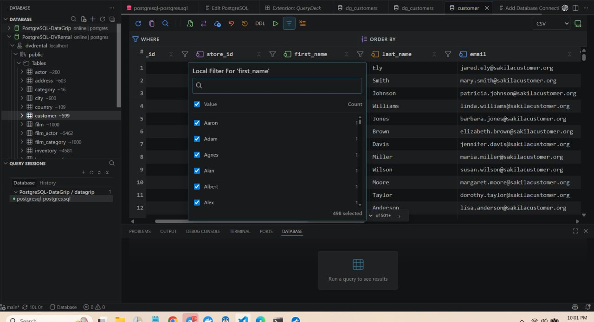

# QueryDeck

AI-first SQL workbench and database client for VS Code.

QueryDeck keeps the everyday database loop inside your editor: connect to databases, browse schemas, run SQL, inspect result grids, search query history, and use AI help without switching tools.

Built for Codex, Claude Code, and AI-assisted SQL workflows with local query memory and table performance recommendations.

Works with PostgreSQL, MySQL, SQLite, Microsoft SQL Server, Oracle, Redis, Snowflake, and Redshift.



## Why QueryDeck?

- **VS Code database client** for local, staging, production, and warehouse connections.
- **SQL editor workflow** with query consoles, `.sql` files, selection execution, and `Ctrl+Enter` / `Cmd+Enter`.
- **Schema explorer** for tables, views, columns, keys, indexes, functions, procedures, triggers, and DDL.
- **Fast result grids** with paging, filters, sorting, copy, export, charts, and pinned tabs.
- **Local query memory search** by phrase, table, column, output field, SQL fragment, file, connection, or status.
- **AI SQL assistant** for explaining SQL, fixing errors, modifying queries, summarizing history, and table performance review.
- **Safer database work** with read-only connections and destructive-query confirmation for production.

## Screenshots

### Connections



### SQL Editor



### PostgreSQL Explorer



### PostgreSQL Table Data



## Daily Workflow

```text
connect -> browse schema -> write SQL -> run query -> inspect results -> search history
```

Use QueryDeck for reporting, analytics checks, migration review, debugging, data cleanup, production support, and exploratory SQL.

## Core Features

| Area | Highlights |
| --- | --- |
| Connections | PostgreSQL, MySQL, SQLite, SQL Server, Oracle, Redis, Snowflake, Redshift |
| Explorer | Schemas, tables, views, columns, keys, indexes, functions, procedures, triggers |
| Querying | Persistent consoles, `.sql` files, selected SQL, current statement, full file, multi-statement batches |
| Results | Grid paging, filters, sorting, copy, CSV/export, charting, pinned result tabs |
| Search | Find past queries by natural phrases, SQL text, tables, columns, files, status, and result fields |
| AI | Explain SQL, fix SQL, modify SQL, summarize query memory, analyze table performance |
| Safety | SecretStorage passwords, local query history, production prompts, read-only connection mode |

## Quick Start

1. Install QueryDeck from the VS Code Marketplace.
2. Open the **Database** activity view.
3. Run **Database: Add Database Connection**.
4. Choose PostgreSQL, MySQL, SQLite, SQL Server, Oracle, Redis, Snowflake, or Redshift.
5. Connect, open a query console, and run SQL with `Ctrl+Enter` or `Cmd+Enter`.

## Search Past Queries

Run **Database: Find Past Query...** and search like this:

```text
monthly revenue by status
failed customer lookup
orders last 30 days
email domain counts
```

QueryDeck searches local query memory across titles, summaries, SQL text, source files, connection names, tables, columns, output columns, and execution status.

## AI SQL Tools

When VS Code language models or an OpenAI-compatible provider are configured, QueryDeck can explain selected SQL, fix failed SQL, rewrite queries from instructions, summarize query memory, and analyze table performance.

Saved database passwords are not sent to AI prompts.

## MCP Server For AI Agents

QueryDeck includes a read-only MCP server for Codex, Claude, Cursor, and other MCP clients. It exposes tools to list database connections, inspect schemas, get table DDL, search query memory, explain queries, and run read-only SQL with row limits.

Create a config file and point your MCP client at `dist/mcpServer.js` from the installed extension or local checkout:

```json
{
  "defaultMaxRows": 100,
  "connections": [
    {
      "id": "local-postgres",
      "name": "Local PostgreSQL",
      "type": "postgres",
      "host": "localhost",
      "port": 5432,
      "database": "postgres",
      "username": "postgres",
      "passwordEnv": "QUERYDECK_POSTGRES_PASSWORD",
      "sslMode": "disable",
      "color": "blue"
    }
  ],
  "queryMemory": []
}
```

Set `QUERYDECK_MCP_CONFIG` to that file and configure the client command as `node dist/mcpServer.js`. MCP query execution is read-only by default; write and destructive statements are rejected.

## Privacy And Safety

- Passwords are stored with VS Code SecretStorage.
- Query history stays local to your VS Code environment.
- Production connections can require confirmation before destructive SQL.
- Read-only connections block non-SELECT-style queries.

## Local Live Tests

The project includes Docker-backed live tests for PostgreSQL, MySQL, Redis, SQL Server, Oracle, and SQLite.

```bash
docker compose -f docker-compose.live-tests.yml up -d postgres
LIVE_DATABASE_ENGINE=postgres npm run test:live
docker compose -f docker-compose.live-tests.yml down -v
```

Use `LIVE_DATABASE_ENGINE=all` after starting the Docker services to run the full live matrix.

## Status

QueryDeck is early and moving quickly. Try it against a real workflow and open issues for missing drivers, rough edges, or SQL workflows that should be faster.
